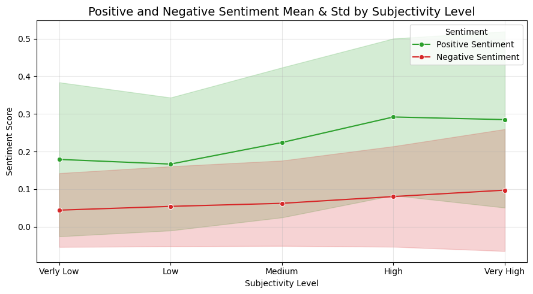
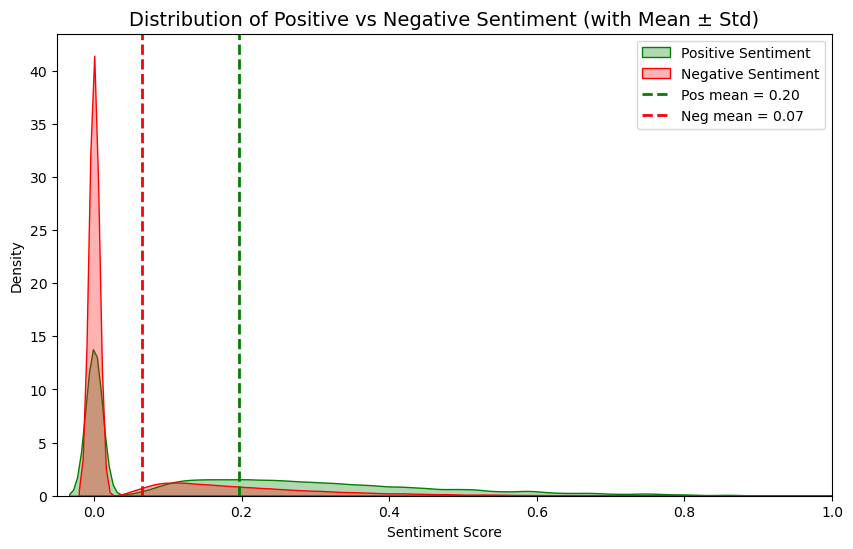

# N-Gram Language Model
Predict the next word in a sequence using N-gram statistics from a text corpus and related applications

## Table of Contents
- [Project Background](#project-background)
- [Project Goal](#project-goal)
- [File Structure](#file-structure)
- [Instructions](#instructions)
  - [1. Packages Used](#1-packages-used)
  - [2. Datasets Used](#2-datasets-used)
  - [3. Create 3 Gram Dataset](#3-create-3-gram-dataset)
  - [4. Phrase Prediction](#4-phrase-prediction)
  - [5. Sentence Generation](#5-sentence-generation)
  - [6. Gradio Interactive Interface](#6-gradio-interactive-interface)
  - [7. Sentiment Analysis](#7-sentiment-analysis)
- [Future Improvements](#future-improvements)
- [Acknowledgements](#acknowledgements)
- [License](#license)

## Project Background
Language models are key tools in natural language processing, enabling machines to predict and generate text. The N-gram model, one of the earliest and most interpretable, estimates word probabilities from preceding context. By capturing word co-occurrence patterns, it reveals local dependencies and common phrase structures. Though simpler than modern deep models, N-grams remain valued for efficiency, clarity, and as strong baselines.

## Project Goal
This project aims to build an N-gram language model using **Python Jupyter Notebook** to predict the next word in a sequence based on historical text data. It explores applications such as query suggestion and automated sentence generation. By filtering out rare occurrences using quantile thresholds, the model reduces noise and improves efficiency, accelerating the sentence generation process.

## File Structure
Configuration & Metadata:
- `README.md` – project overview
- `LICENSE.txt` – license information
- `.gitignore` – git ignore config
- `.gitattributes` – git attributes config
- `images/` – folder containing project-related screenshots and visual outputs
  - `instructions-6_20250826.png` – visualization of *Gradio Interactive Interface*
  - `instructions-7-1_20251111.png` – visualization of *Positive and Negative Sentiment Mean & Std by Subjectivity Level*
  - `instructions-7-2_20251111.png` – visualization of *Distribution of Positive vs Negative Sentiment (with Mean ± Std)*

Core Logic:
- `N-gram_modeling.ipynb` – notebook for ngram modeling
- `sentiment_analysis.ipynb` – notebook for sentiment analysis
- `simplified_data.csv` – smaller cleaned CSV file containing processed Twitter text data

## Instructions

### 1. Packages Used
- `pandas`, `np`, `re`, `random`, `collections`: for data manipulation
- `gradio`: for building web-based interactive interface
- `seaborn`, `matplotlib`: for graphing and visualization
- `vaderSentiment`, `textblob`, `afinn`: for sentiment analysis score
- `warnings`: core Python libraries for basic system operations

### 2. Datasets Used
This project utilizes the U.S. Twitter dataset provided as part of the [*John Hopkins University: Data Science Specialization*](https://www.coursera.org/specializations/jhu-data-science) on Coursera. The dataset contains over 2.36 million lines of text, offering a large-scale corpus for language modeling and text analysis tasks.

Due to licensing restrictions, the raw dataset cannot be shared in this repository. Instead, you may obtain the data by enrolling in the course.

### 3. Create 3 Gram Dataset
The text corpus (raw Twitter Enlgish text) is processed to construct a N-gram (using 3 as an example) dataset. Each line of text is cleaned to remove non-alphanumeric characters, converted to lowercase, and split into words. Using a sliding window, all consecutive three-word sequences are extracted, and their frequencies are counted.

The collected 3-grams are then transformed into a DataFrame, storing the three words, raw counts, and relative frequencies by conditioning on the first two words. This makes it possible to understand how likely a particular third word follows a given two-word context.

Finally, the dataset is explored by ranking the most frequent 3-grams and computing quantile thresholds to identify and remove very rare cases. This filtering reduces noise and accelerates later modeling steps, while preserving the most informative 3-grams for prediction and sentence generation tasks.

### 4. Phrase Prediction
A phrase prediction module is implemented based on the previously created 3-gram dataset. It first defines a function to validate and clean the input text, ensuring that exactly two words are provided. Using these two words as context, the model searches the 3-gram dataset for matching entries and retrieves the most likely third words.

The predicted words are displayed along with their relative probabilities, calculated from the normalized frequency of occurrence in the dataset. This allows the model to suggest the most plausible continuations of a phrase, effectively simulating next-word prediction in natural language processing tasks.

### 5. Sentence Generation
Given two input words (validated and cleaned), the model repeatedly looks up all 3-grams that share the same first two words and samples a third word from the candidate list. The newly chosen word becomes part of the context, sliding the window forward (the second word becoming the first word, the thrid word becoming the second word), and the process continues until no continuation exists. To avoid repetitive word loops, a random selection strategy is applied when choosing the next word.

By chaining these local next-word predictions, the module produces a fluent sentence that reflects patterns in the corpus. The earlier quantile filtering of rare 3-grams helps reduce noise and speeds up generation while keeping the output readable.

### 6. Gradio Interactive Interface
Instead of running predictions directly from code cells, users can input words and instantly see the results through a simple web-based interactive interface enabled by *Gradio*:
- On the left panel, users enter two words to perform word prediction. The interface outputs a prediction table showing possible next words and their associated ratios, as well as the total prediction ratio.
- On the right panel, users enter two words to perform sentence generation, where the model iteratively produces a sentence based on 3-gram probabilities.

### 7. Sentiment Analysis
This module evaluates tweet sentiments using *VADER*, *AFINN*, and *TextBlob*, capturing multiple perspectives of emotional tone.

A separate Jupyter Notebook `sentiment_analysis.ipynb` reads the Twitter dataset line by line into a DataFrame, where each row represents a tweet. Sentiment scores are extracted for every entry:
- `sia_pos` — from `vaderSentiment`, positive sentiment score (0–1), indicating the degree of positive emotion.
- `sia_neg` — from `vaderSentiment`, negative sentiment score (0–1), indicating the degree of negative emotion.
- `sia_neu` — from `vaderSentiment`, neutral sentiment score (0–1), indicating how much of the text is emotionally neutral.
- `sia_comp` — from `vaderSentiment`, compound sentiment score, normalized between –1 (most negative) and +1 (most positive).
- `tb_polarity` — from `TextBlob`, overall polarity score, indicating the overall positivity or negativity of the text.
- `tb_subjectivity` — from `TextBlob`, overall subjectivity score, indicating how opinion-based or subjective the text is.
- `afinn` — from `Afinn`, sentiment score, calculated by summing predefined positive and negative word-level sentiment values.

Key Findings:
1. Correlations among the three sentiment models increase with higher subjectivity, indicating that model outputs are more consistent and reliable when tweets are emotionally expressive.
2. Across all subjectivity levels, positive sentiment consistently outweighs negative sentiment, suggesting that tweets generally convey optimism.
   
4. As subjectivity rises, negative sentiment scores shift upward, implying that highly subjective texts express stronger negative emotions.
5. Positive scores are higher on average and more widely distributed, while negative scores are mostly concentrated near zero with a thin tail.
   

## Future Improvements
- **Smoothing Techniques**: Implement methods such as Laplace or Kneser–Ney smoothing to handle unseen N-grams and reduce zero-probability issues.
- **Performance Optimization**: Precompute and cache N-gram mappings or use efficient data structures to speed up text generation.
- **Expanded Text Sources**: Incorporate larger and more diverse corpora (e.g., news, books, social media) to enhance model generalization.

## Acknowledgements
- This project was inspired by the [*John Hopkins University: Data Science Specialization*](https://www.coursera.org/specializations/jhu-data-science) Capstone on [*Coursera*](https://www.coursera.org/).
- Thanks to [`gradio`](https://pypi.org/project/gradio/) for enabling the interactive app interface.
- Thanks the following libraries for enabling sentiment analysis possible, including:
  - [`vaderSentiment`](https://pypi.org/project/vaderSentiment/)
  - [`afinn`](https://pypi.org/project/afinn/)
  - [`textblob`](https://pypi.org/project/textblob/)

## License
This project is licensed under the MIT License - see the  file for details.
